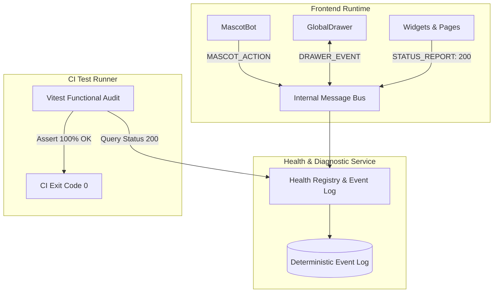
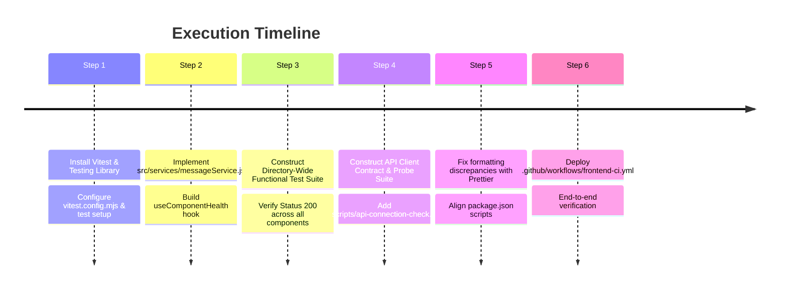

# Frontend CI Workflow & Testing Suite: Implementation Plan

> **Document Version**: 1.0.0  
> **Target Directory**: `root/frontend/`  
> **Associated CI Workflow**: `.github/workflows/frontend-ci.yml`  
> **Status**: Ready for Implementation

---

## 1. Executive Summary & Objective

This document outlines the architectural blueprint and phased implementation plan to establish continuous integration (CI) and automated testing for the `root/frontend` workspace.

### Key Deliverables

1. **GitHub Actions CI Workflow** (`.github/workflows/frontend-ci.yml`): Automated linting, code formatting checks, unit/functional testing, and production build validation.
2. **Custom Internal Message & Health Service** (`src/services/messageService.js`): A lightweight, deterministic event bus for in-project communication and component health auditing (Status 200 protocol).
3. **Directory-Wide Functional Test Suite** (`test/functional/components-audit.test.jsx`): Comprehensive mount and status 200 verification across 100% of components and functional modules.
4. **API Connection & Status Check Suite** (`test/api/api-client.test.js` & `scripts/api-connection-check.js`): Contract tests and an automated CLI endpoint connectivity probe.
5. **Mock User Test Suite Architecture** (`test/e2e/user-flows.test.jsx`): Structured user-journey test scaffolds ready for expansion.

---

## 2. Current Architecture Baseline

| Attribute                | Specification                         | Notes                                        |
| :----------------------- | :------------------------------------ | :------------------------------------------- |
| **Framework**            | React 18.3.1 + Vite 8.2.2             | ESM (`"type": "module"`)                     |
| **Styling**              | Tailwind CSS v4 (`@tailwindcss/vite`) | Hardware-accelerated CSS theme               |
| **Graphics & Animation** | Three.js + SVG Kinematics             | Dynamic 3D vector backgrounds & MascotBot    |
| **Linting & Code Style** | ESLint 9 (Flat Config) + Prettier     | Prettier requires formatting alignment       |
| **Production Build**     | `npm run build`                       | Verified output (`dist/`) in under 3 seconds |
| **Target Node Engine**   | Node `>=22.12.0`                      | Compatible with Node 22 and 24 LTS           |

---

## 3. Custom Internal Message & Health Service

### Architectural Concept

In line with the project's event-driven philosophy (as highlighted in the development bulletin and library), the internal message service fulfills two roles:

1. **Runtime In-Project Communication**: Decouples MascotBot actions, Drawer interactions, and telemetry events without prop-drilling.
2. **Diagnostic & Testing Status Protocol**: Components and functions report their operational readiness. A clean mount and initialization registers an HTTP-style status `200 OK`. If a component encounters an unhandled state, it registers status `500` or `503`.



### Module Design: `src/services/messageService.js`

```javascript
/**
 * Lightweight Internal Message & Health Service
 * Supports decoupled pub/sub messaging and component status diagnostics.
 */

const subscribers = new Map();
const healthRegistry = new Map();
const eventLog = [];

export const TOPICS = {
  DRAWER: 'drawer:event',
  MASCOT: 'mascot:action',
  TELEMETRY: 'telemetry:status',
  NOTIFICATION: 'ui:notification',
  HEALTH: 'component:health',
};

export const messageService = {
  /**
   * Publish an event to a specific topic
   */
  publish(topic, payload) {
    const timestamp = performance.now();
    const event = { topic, payload, timestamp };
    eventLog.push(event);

    if (subscribers.has(topic)) {
      subscribers.get(topic).forEach((callback) => {
        try {
          callback(payload, event);
        } catch (err) {
          console.error(`Error in subscriber for topic "${topic}":`, err);
        }
      });
    }
  },

  /**
   * Subscribe to an event topic
   */
  subscribe(topic, callback) {
    if (!subscribers.has(topic)) {
      subscribers.set(topic, new Set());
    }
    subscribers.get(topic).add(callback);
    return () => subscribers.get(topic).delete(callback);
  },

  /**
   * Report component operational health (Status 200 Protocol)
   */
  reportHealth(componentName, status = 200, details = {}) {
    const record = {
      component: componentName,
      status,
      statusText: status === 200 ? 'OK' : 'ERROR',
      timestamp: performance.now(),
      ...details,
    };
    healthRegistry.set(componentName, record);
    this.publish(TOPICS.HEALTH, record);
    return record;
  },

  /**
   * Get recorded health for a component
   */
  getHealth(componentName) {
    return healthRegistry.get(componentName);
  },

  /**
   * Retrieve all component health records for audit
   */
  getAuditReport() {
    return Array.from(healthRegistry.values());
  },

  /**
   * Clear registries (used between test runs)
   */
  reset() {
    subscribers.clear();
    healthRegistry.clear();
    eventLog.length = 0;
  },
};
```

---

## 4. Test Suite Specifications

### Test 1: Directory-Wide Functional Test Suite (Status 200 Audit)

- **Target File**: `test/functional/components-audit.test.jsx`
- **Test Runner**: Vitest + Happy-DOM + `@testing-library/react`
- **Verification Scope**:

```
root/frontend/src/
├── pages/
│   ├── Home.jsx                    -> Mounts, dispatches status: 200
│   ├── Library.jsx                 -> Mounts, dispatches status: 200
│   └── Project.jsx                 -> Mounts, dispatches status: 200
├── components/
│   ├── background/
│   │   └── VectorBackground.jsx    -> SVG matrix renders without layout errors
│   ├── bulletin/
│   │   └── BulletinWidget.jsx      -> Slide cycling & status badges pass
│   ├── coding/
│   │   ├── CodingSummary.jsx       -> Renders languages/projects correctly
│   │   └── CodingTracker.jsx       -> Handles mock API feed & slides
│   ├── contact/
│   │   └── Services.jsx            -> AutoSwitchHireTag cycles smoothly
│   ├── drawer/
│   │   ├── Drawer.jsx              -> Transition overlays mount cleanly
│   │   ├── DrawerContext.jsx       -> Context provider opens/closes properly
│   │   └── GlobalDrawer.jsx        -> Hire, Contact, Chat forms mount
│   ├── github/
│   │   ├── ContributionHeatmap.jsx -> Grid calculations & SVG heat cells OK
│   │   ├── GitHubShowcase.jsx      -> Metric badges render without null errors
│   │   ├── GithubWidget.jsx        -> Widget shell & commit states load
│   │   └── RepositoryGrid.jsx      -> Repository list cards format correctly
│   ├── layout/
│   │   └── AlternatingStoryRow.jsx -> Reverse layouts & slots render cleanly
│   ├── leetcode/
│   │   └── LeetcodeStats.jsx       -> Fallback mock & progress bars calculate
│   ├── library/
│   │   ├── ArticleCard.jsx         -> Tags & read times calculate properly
│   │   └── DocumentCard.jsx        -> File size badges render
│   ├── mascot/
│   │   ├── MascotBot.jsx           -> SVG Chassis & Face mount without canvas error
│   │   ├── components/MascotChassis.jsx
│   │   ├── components/MascotFace.jsx
│   │   └── utils/armKinematics.js  -> Kinematic transformations output valid coords
│   ├── miscellaneous/
│   │   ├── Header.jsx              -> Nav items map to active route
│   │   ├── Footer.jsx              -> Dynamic year & links present
│   │   ├── WidgetShell.jsx         -> Slots & headers mount correctly
│   │   ├── ErrorState.jsx          -> Error boundary displays label
│   │   └── LoadingState.jsx        -> Shimmer skeleton renders
│   └── tech/
│       └── TechStackBento.jsx      -> Grid categories & icon badges verify
└── hooks/
    ├── usePathname.js              -> Hash & pathname normalization verify
    ├── useMascotArms.js            -> Arm state transitions evaluate cleanly
    └── useMascotMovement.js        -> Pointer drag delta math verifies
```

---

### Test 2: API Connection & Status Check Suite

#### A. Client Contract & Unit Tests (`test/api/api-client.test.js`)

- Tests `apiRequest` in `src/api/client.js`:
  - Returns parsed JSON on `res.ok === true` (status 200).
  - Injects `Content-Type: application/json` headers.
  - Properly respects `VITE_API_BASE_URL`.
  - Throws structured error `API error: ${status}` on non-200 responses.
- Tests all endpoints in `src/api/fetchApi.js`:
  - `getCodingActivity({ refresh })` -> GET `/api/coding`
  - `getCodingSummary({ refresh })` -> GET `/api/coding/summary`
  - `fetchGitHubSummary()` -> GET `/api/github/summary`
  - `fetchGitContributions()` -> GET `/api/github-contributions`
  - `fetchLeetcodeStats()` -> GET `/api/leetcode`
  - `sendContact(payload)` -> POST `/api/contact`
  - `sendHireRequest(payload)` -> POST `/api/hireRequest`
  - `sendChatMessage(messages)` -> POST `/api/chat`

#### B. Automated Route Status Probe (`scripts/api-connection-check.js`)

- Mirroring the backend's `scripts/route-check.js`, this script probes an active or ephemeral test backend instance:
  - Generates a tabular report with Endpoint, Method, Expected Status, Actual Status, and Latency.
  - Asserts status 200 on healthy data routes and status 405 on method guards.

---

### Test 3: Mock User Test Suite (Phase 3 - Deferred)

- **Target File**: `test/e2e/user-flows.test.jsx`
- **Scenarios Pre-Engineered**:
  1. **Page Routing**: Simulates user clicking navigation links (`/` -> `/library` -> `/project`) and asserts that the appropriate page component mounts.
  2. **Service Inquiry Flow**: User clicks `AutoSwitchHireTag` -> GlobalDrawer slides open -> User completes form -> Form dispatches message event -> Drawer closes.
  3. **Mascot Companion Interaction**: User hovers on MascotBot -> triggers `wave` kinematics -> User clicks MascotBot -> drawer opens in `chat` mode.

---

## 5. GitHub Actions CI Workflow Specification

### File Path: `.github/workflows/frontend-ci.yml`

```yaml
name: Frontend CI

on:
  push:
    branches: [main, interface, dev]
    paths:
      - 'root/frontend/**'
      - '.github/workflows/frontend-ci.yml'
  pull_request:
    branches: [main, interface, dev]
    paths:
      - 'root/frontend/**'
      - '.github/workflows/frontend-ci.yml'
  workflow_dispatch:
    inputs:
      run_tests_only:
        description: 'Skip linter and only run tests?'
        type: boolean
        default: false

jobs:
  build-and-test:
    runs-on: ubuntu-latest

    defaults:
      run:
        working-directory: root/frontend

    env:
      VITE_API_BASE_URL: ${{ secrets.VITE_API_BASE_URL || '' }}

    steps:
      - name: Checkout Code
        uses: actions/checkout@v4

      - name: Setup Node.js 22
        uses: actions/setup-node@v4
        with:
          node-version: 22
          cache: 'npm'
          cache-dependency-path: root/frontend/package-lock.json

      - name: Install Dependencies
        run: npm ci

      - name: Run Linter
        if: ${{ !inputs.run_tests_only }}
        run: npm run lint

      - name: Check Code Formatting
        if: ${{ !inputs.run_tests_only }}
        run: npm run format:check

      - name: Run Frontend Tests
        run: npm test

      - name: Verify Production Build
        run: npm run build
```

---

## 6. Implementation Steps



### Dependency Configuration (`package.json`)

```json
{
  "scripts": {
    "dev": "vite --config vite.config.mjs",
    "build": "vite build",
    "preview": "vite preview",
    "lint": "eslint .",
    "lint:fix": "eslint . --fix",
    "format": "prettier --write .",
    "format:check": "prettier --check .",
    "test": "vitest run",
    "test:watch": "vitest",
    "check:api": "node scripts/api-connection-check.js"
  },
  "devDependencies": {
    "@testing-library/jest-dom": "^6.6.3",
    "@testing-library/react": "^16.2.0",
    "happy-dom": "^17.1.0",
    "vitest": "^3.0.7"
  }
}
```

---

## 7. Success & Verification Checklist

- [ ] All components mount in headless DOM without unhandled runtime exceptions.
- [ ] Every component registers an operational `status: 200` with `messageService`.
- [ ] All API functions in `fetchApi.js` pass request contract checks.
- [ ] `npm test` runs deterministically in under 5 seconds.
- [ ] `npm run format:check` and `npm run lint` report 0 errors.
- [ ] `npm run build` completes successfully.
- [ ] `.github/workflows/frontend-ci.yml` is committed and triggers on push/PR events.
